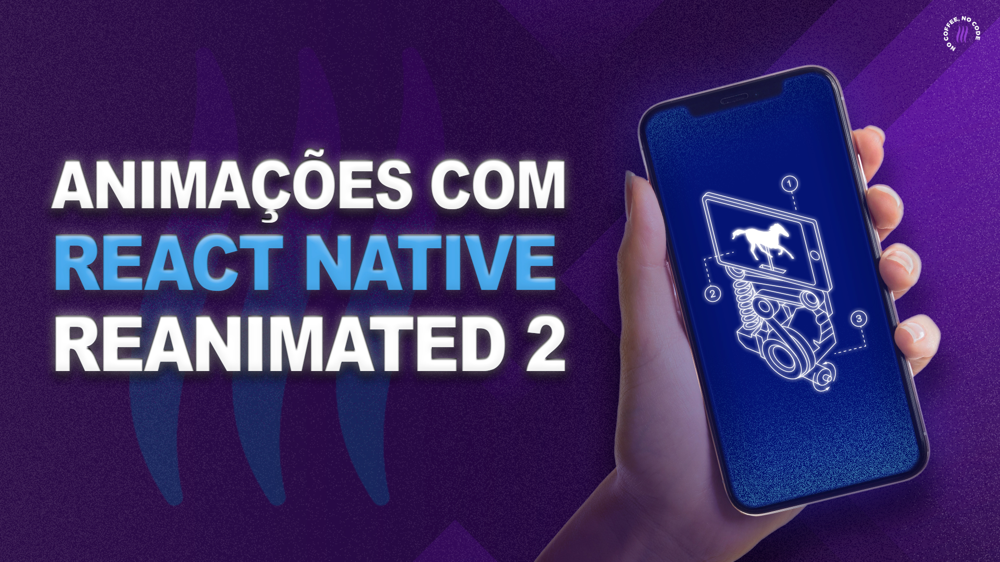

<h2>Layout Animation com React Native Reanimated 2
</h2>

 

Este projeto foi construído para o vídeo [ANIMAÇÕES PRONTAS no React Native (SÓ PEGAR E USAR)](https://youtu.be/w6oHLMjeoec) em nosso canal no YouTube.
Essa é a forma mais simples para você começar a entender e utilizar animações no React Native. Nesse tutorial você conhecerá animações de layout pré-definidas e muito fácil de utilizar.

## O que você aprenderá?

- Configurar a biblioteca React Native Reanimated 2.
- Criar animações de layout de uma forma simples.
- Entender os conceitos chaves por traz das animações.
- Combinar animações e formar um efeito de carousel em cards.

## Redes Sociais:

Instagram: @coffstack https://www.instagram.com/coffstack/
TikTok: @coffstack https://www.tiktok.com/@coffstack
Twitter: @coffstack https://twitter.com/coffstack
Blog: https://blog.coffstack.com/
Instagram: @lucasgar6 https://www.instagram.com/lucasgar6/
